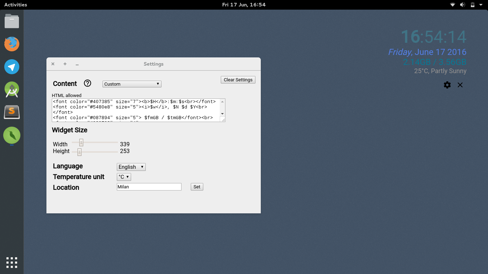

#Hachidori *(ハチドリ)*

Hachidori is a programmable desktop widget.

This is what it looks like:

###Compiling for GNU/Linux:
npm is required. Execute:
`npm run build-linux`
To launch it,
`./Hachidori.sh`

###Compiling for Windows
Node.js is required. Execute:
`npm run build-win`
And then just double click on that friendly little icon.